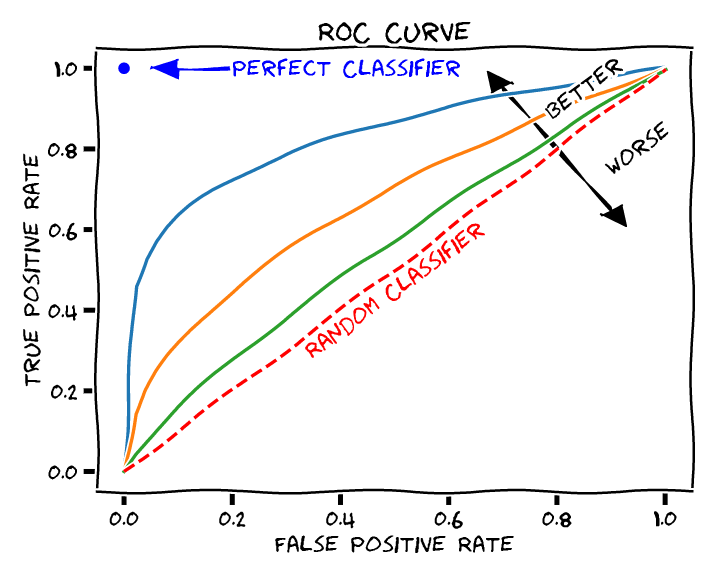
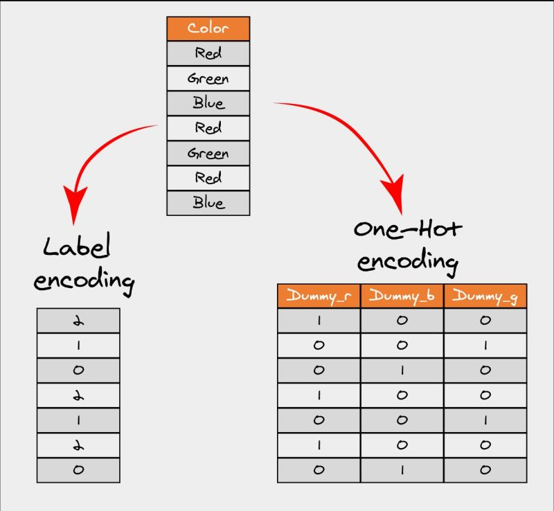

# Analítica Descriptiva

---

## 1. Evaluación Inicial del Modelo

### 📌 Revisar métricas adecuadas para el problema

**Clasificación**:

- *Accuracy: Porcentaje de predicciones correctas. Útil solo en clases balanceadas.*
- *Precision: Proporción de predicciones positivas correctas (evitar falsos positivos).*
- *Recall: Proporción de casos positivos reales detectados (evitar falsos negativos).*
- *F1: Media armónica de precision y recall. Ideal para balancear ambas métricas.*
- *ROC AUC: Evalúa la capacidad del modelo para distinguir entre clases (1 = perfecto, 0.5 = aleatorio).*
    
    
    
- PR AUC: *Evalúa el área bajo la curva precision vs recall → Evalúa qué tan bien el modelo identifica los positivos verdaderos, prestando atención a los falsos positivos y falsos negativos.*
    
    
    

**Regresión**:

- *MSE (Error Cuadrático Medio): Penaliza errores grandes (sensibilidad a outliers).*
- *RMSE: Raíz de MSE. Interpretable en la misma unidad que la variable objetivo.*
- *MAE (Error Absoluto Medio): Promedio de errores absolutos (menos sensible a outliers).*
- *MAPE (Error Porcentual Absoluto Medio): Promedio del error absoluto expresado como porcentaje del valor real. Intuitivo para comunicar resultados en términos relativos (“el modelo se equivoca en promedio un 8 %”).*
- *R²: Proporción de varianza explicada (1 = perfecto, 0 = modelo básico).*


**Clustering:**

- *Silhouette Score: Mide cuán bien separado y compacto está cada cluster (-1 a 1)*
- *Davies–Bouldin Index (DBI): RPromedia la relación entre la dispersión interna y la separación entre clusters (0 a inf). Cuanto menor, mejor.*
- *Calinski–Harabasz Index (CHI): Relación entre la dispersión entre clusters y dentro de ellos. Cuanto mayor, mejor la separación.*

<aside>
📌

En clustering, la evaluación depende de si existen etiquetas de referencia. En la mayoría de los casos, se utilizan métricas internas (como Silhouette o Davies–Bouldin) para comparar la calidad relativa entre diferentes modelos o cantidades de clusters.

</aside>

### ⚠️ Dataset Desbalanceado

- **Problema**: El **accuracy** puede ser engañoso (ej: 95% accuracy con 95% de casos en una clase).
- **Solución**:
    - Usar **F1** o **ROC AUC/PR AUC** para evaluar el modelo.
    - Priorizar **recall** si es crítico detectar todos los positivos (ej: diagnóstico médico).

### 🔍 Validar Overfitting/Underfitting

**Cómo detectarlo → c**omparar métricas en **train** vs **test**:

- **Overfitting**:
    - Ejemplo: Train accuracy = 0.98, Test accuracy = 0.65.
    - Causa: Modelo memoriza el entrenamiento y no generaliza.
- **Underfitting**:
    - Ejemplo: Train accuracy = 0.55, Test accuracy = 0.52.
    - Causa: Modelo es demasiado simple para capturar patrones.


**Acciones clave**:

- **Overfitting**: Reducir complejidad (regularización, menos *features*, más datos).
- **Underfitting**: Aumentar complejidad (mejores *features*, modelo más potente).

## 2. Diagnóstico: ¿Qué está fallando?

### 📊 Desbalanceo de Clases

**🔍 Cómo identificarlo:**

- Verificar la proporción entre clases (ej: 90% clase A vs. 10% clase B).
- Analizar la **matriz de confusión**:
    - Si el modelo tiene muchos falsos negativos o positivos en la clase minoritaria.

**🛠 Soluciones posibles:**

- **Técnicas de remuestreo**:
    - **Oversampling**: Generar más ejemplos de la clase minoritaria (SMOTE).
    - **Undersampling**: Reducir ejemplos de la clase mayoritaria.
- **Métricas alternativas**: Usar **F1, Recall (sensibilidad) o PR AUC** en lugar de accuracy.
- **Pesos de clase**: Ajustar **`class_weight`** en modelos como LogisticRegression o RandomForest.

### 📉 Underfitting (Modelo demasiado simple)

**🔍 Síntomas:**

- Bajas métricas tanto en **train** como en **test** (ej: accuracy ~50% en ambos).
- El modelo no capta patrones complejos en los datos.

**🛠 Soluciones posibles:**

1. **Modelos más complejos**:
    - Cambiar de Regresión Logística a **RandomForest, XGBoost o Redes Neuronales**.
2. **Mejorar *features***:
    - Añadir características relevantes o generar nuevas (*feature engineering*).
    - Usar transformaciones polinómicas o interacciones entre variables.
3. **Reducir regularización**: Si el modelo tiene parámetros como **`C`** (en SVM) o **`alpha`** (en Ridge/Lasso), disminuirlos.

---

### 📈 Overfitting (Modelo memoriza el ruido)

**🔍 Síntomas:**

- **Train** tiene métricas altas (ej: 98%), pero **test** es bajo (ej: 70%).
- El modelo ajusta demasiado los detalles (incluyendo el ruido).

**🛠 Soluciones posibles:**

1. **Regularización:**
    - Añadir penalizaciones (L1/Lasso, L2/Ridge) para simplificar el modelo.
    - Ajustar hiperparámetros como **`max_depth`** en árboles o **`min_samples_split`**.
2. **Reducir complejidad:**
    - Disminuir el número de *features* (selección con **`SelectKBest`** o análisis de importancia).
    - Usar técnicas de **pruning** en árboles de decisión.
3. **Más datos:**
    - Aumentar el dataset (data augmentation en imágenes/texto).
4. **Validación cruzada:**
    - Usar **`cross_val_score`** para asegurar que el modelo generaliza bien.

---

### 🔎 Resumen de Acciones por Problema

| **Problema** | **Diagnóstico** | **Posibles Soluciones** |
| --- | --- | --- |
| **Desbalanceo** | Clases desiguales, errores en minoritarias | Oversampling, F1/Recall, class\_weight |
| **Underfitting** | Mal desempeño en train y test | Modelos más complejos, mejor feature engineering |
| **Overfitting** | Buen train, mal test | Regularización, simplificar modelo, más datos |

## 3. Tratamiento del Desbalance

El desbalance de clases ocurre cuando una clase domina sobre las demás, afectando el aprendizaje del modelo. Estas son las estrategias principales para manejarlo:

### 🔄 Re-muestreo

**Técnicas para ajustar la distribución de clases:**


### ↑ Oversampling (Aumentar la clase minoritaria)

- **SMOTE (Synthetic Minority Over-sampling Technique):**
    - Genera ejemplos sintéticos interpolando datos de la clase minoritaria.
    - **Ventaja:** Evita la duplicación exacta de datos.
    - **Limitación:** Puede crear muestras poco realistas en espacios de alta dimensión.
        
        
        
- **ADASYN:**
    - Similar a SMOTE, pero enfocado en muestras difíciles de clasificar.
- **Duplicación aleatoria:**
    - Simple pero puede causar sobreajuste si el modelo memoriza repeticiones.

### ↓ Undersampling (Reducir la clase mayoritaria)

- **Random Undersampling:**
    - Elimina aleatoriamente muestras de la clase mayoritaria.
    - **Riesgo:** Pérdida de información valiosa.
- **Técnicas avanzadas:**
    - **Tomek Links:** Elimina muestras cercanas al límite entre clases.
        
        
        
    - **Cluster Centroids:** Reduce la mayoría agrupando y conservando representantes.

### 🔄 Combinado (SMOTE + Tomek Links)

- Aplica *oversampling* en la minoría y *undersampling* en la mayoría.
- **Ventaja:** Balancea el dataset sin perder información crítica.

### ⚖️ Ponderación de Clases

**Alternativa al re-muestreo:** ajustar el peso de las clases en el modelo.

- **`class_weight='balanced'`:**
    - Asigna pesos inversamente proporcionales a la frecuencia de las clases.
    - **Modelos compatibles:** **`LogisticRegression`**, **`RandomForest`**, **`SVM`**.
- **Pesos personalizados:**
    - Ejemplo: **`class_weight={0: 1, 1: 10}`** (prioriza la clase **`1`**).

**¿Cuándo usarlo?**

- Cuando el re-muestreo no es viable (ej.: datasets muy grandes).
- Para evitar el costo computacional de generar muestras sintéticas.

---

### 📊 Métricas Adecuadas para Desbalance

**Evitar:** **`Accuracy`** (engañosa si una clase domina).

**Priorizar:**

- **F1-score:** Balance entre *precision* y *recall*. Ideal cuando ambas métricas importan.
- **PR-AUC (Precision-Recall AUC):**
    - Mejor que ROC-AUC si hay muchas más negativas que positivas.
    - Evalúa el rendimiento en la clase minoritaria.

**Ejemplo de uso:**

- En fraudes (clase positiva rara), optimizar para **F1 o Recall** (captar todos los casos).

---

### 🔍 Resumen: Estrategias vs. Contexto

| **Técnica** | **Ventajas** | **Cuándo Usarla** |
| --- | --- | --- |
| **SMOTE** | Evita duplicados, mejora generalización | Datos tabulares, tamaño moderado |
| **Undersampling** | Rápido, reduce costo computacional | Dataset muy grande, mayoría redundante |
| **Ponderación** | Sin alterar datos, fácil de implementar | Modelos que soportan **`class_weight`** |
| **F1/PR-AUC** | Enfocado en la clase relevante | Evaluación final tras ajustes |

**Siguiente paso:** Validar si las correcciones mejoraron el modelo (comparar métricas antes/después).

## 4. Feature Engineering

El *feature engineering* es el proceso de crear, transformar y seleccionar variables para mejorar el rendimiento del modelo. Estas son las técnicas clave:

### ✨ Creación de Nuevas Features

**Objetivo:** Capturar patrones no evidentes en los datos crudos.

**Ejemplos comunes:**

- **Temporalidad:** Extraer *día de la semana*, *hora*, o *diferencia entre fechas*.
- **Agregaciones:** Promedios/máximos por categoría (ej: gasto promedio por cliente).
- **Ratios:** Proporciones entre variables (ej: ingresos/deudas).
- **Interacciones:** Combinar *features* (ej: **`edad * ingreso`**).

**Caso de uso:**

- En un modelo de *churn*, crear:
    - **`días_sin_actividad`** (fecha actual - última compra).
    - **`gasto_promedio_últimos_3_meses`**.

### 🔄 Transformaciones

**Para distribuciones no lineales o *outliers*:**

- **Logaritmo (`np.log1p`)**:
    - Reduce el impacto de valores extremos (ej: ingresos).
- **Bucketización (Binning)**:
    - Convertir variables continuas en categóricas (ej: edades → rangos).
- **Escalado:**
    - Normalización (**`MinMaxScaler`**) o estandarización (**`StandardScaler`**).
        
        ### `MinMaxScaler`
        
        **Qué hace:**
        
        - Transforma los datos para que estén en un **rango específico** (por defecto, **`[0, 1]`**).
        - Fórmula:
        
        $$
        X_{\text{scaled}} = \frac{X - X_{\text{min}}}{X_{\text{max}} - X_{\text{min}}}
        $$
        
        **Características:**
        
        - **Ventaja:** Útil cuando la distribución no es normal o cuando necesitas que los datos estén acotados (ej.: imágenes/píxeles en **`[0, 1]`**).
        - **Desventaja:** Sensible a **outliers** (un valor extremo afecta el escalado de toda la columna).
        
        **Ejemplo de uso:**
        
        - Normalizar píxeles de imágenes (**`0-255`** → **`0-1`**).
        - *Features* donde el límite mínimo/máximo tiene significado (ej.: porcentajes).
        
        ---
        
        ### `StandardScaler`
        
        **Qué hace:**
        
        - Estandariza los datos para que tengan **media = 0** y **desviación estándar = 1**.
        - Fórmula:
        
        $$
        X_{\text{scaled}} = \frac{X - \mu}{\sigma} \quad \text{(donde } \mu = \text{media, } \sigma = \text{desviación estándar)}
        $$
        
        **Características:**
        
        - **Ventaja:** Funciona bien con distribuciones normales (o cerca de lo normal) y es menos sensible a *outliers* que **`MinMaxScaler`**.
        - **Desventaja:** No garantiza un rango fijo (puede haber valores fuera de **`[-3, 3]`**).
        
        **Ejemplo de uso:**
        
        - Algoritmos que asumen distribución normal (ej.: SVM, regresión lineal).
        - Datos con *outliers* moderados (la estandarización "suaviza" su impacto).
        
        ---
        
        ### 📌 Comparación Directa
        
        | **Criterio** | **`MinMaxScaler`** | **`StandardScaler`** |
        | --- | --- | --- |
        | **Rango** | **`[0, 1]`** (o personalizado) | Sin rango fijo (media=0, std=1) |
        | **Outliers** | Muy afectado | Menos afectado |
        | **Distribución** | No requiere normalidad | Ideal para distribuciones normales |
        | **Uso típico** | Redes neuronales, imágenes | SVM, PCA, modelos lineales |
        
        ---
        
        ### ¿Cuál elegir?
        
        - Usa **`MinMaxScaler`** si:
            - Necesitas un rango específico (ej.: algoritmos que requieren *inputs* en **`[0, 1]`**).
            - Los datos no tienen *outliers* extremos.
        - Usa **`StandardScaler`** si:
            - Trabajas con modelos sensibles a la escala (SVM, regresión).
            - Hay *outliers*, pero no quieres que dominen el escalado.
        
        **Nota:** En duda, prueba ambos y compara el rendimiento del modelo.
        
        ---
        
        ### ¿Podés entrenar sin escalar?
        
        Sí, **podés** entrenar sin escalar, y el modelo igual va a funcionar. Pero depende **qué tipo de modelo** uses → Algunos algoritmos son **insensibles a la escala**, otros **la necesitan sí o sí**.
        
        ---
        
        ### Modelos que **no necesitan escalado**
        
        Estos modelos se basan en **árboles de decisión o particiones del espacio**, por lo que **no les importa si una variable está en metros o en millones**:
        
        - `DecisionTreeClassifier` / `Regressor`
        - `RandomForest`
        - `XGBoost`, `LightGBM`, `CatBoost`
        
        **Ejemplo: s**i una variable vale 5 y otra 5000, el árbol usa “>” o “<” para dividir, no distancias. Entonces el rango numérico no afecta la lógica.
        
        ---
        
        ### Modelos que **sí necesitan escalado**
        
        Estos modelos usan **distancias, gradientes o magnitudes absolutas**: si las variables están en escalas distintas, una domina a las otras.
        
        - Regresión lineal / logística
        - SVM (Support Vector Machine)
        - KNN (K-Nearest Neighbors)
        - PCA, t-SNE, K-Means, etc.
        - Redes neuronales (el escalado ayuda muchísimo a la convergencia)
        
        Sin escalar, una variable con valores grandes puede “pisar” a las demás, y el modelo **pierde sensibilidad** frente a las que están en rangos pequeños.
        
        ---
        
        ### ¿Mejora la performance?
        
        Depende del modelo:
        
        | Tipo de modelo | Escalado necesario | Efecto del escalado |
        | --- | --- | --- |
        | Árboles / Random Forest / XGBoost | ❌ No | Prácticamente nulo |
        | Regresión lineal / logística | ✅ Sí | Mejora estabilidad y convergencia |
        | SVM, KNN, K-Means | ✅ Sí | Mejora precisión y reduce sesgos |
        | Redes neuronales | ✅ Muy recomendado | Acelera el entrenamiento y evita saturación |
        
        ---
        
        ### En resumen
        
        - **Podés entrenar sin escalar**, pero en muchos modelos el resultado será peor o inestable.
        - El escalado **no cambia la información**, pero **armoniza las magnitudes** para que los algoritmos comparen “manzanas con manzanas”.
        - En modelos basados en distancias o gradientes, **sí mejora la performance y estabilidad**.

---

### 📊 Encoding de Variables Categóricas



1. **One-Hot Encoding** (**`pd.get_dummies`**, **`OneHotEncoder`**):
    - **Qué hace:** Crea una columna binaria (0/1) por cada categoría.
    - **Ejemplo:** País → **`país_Argentina`**, **`país_Brasil`**, **`país_Chile`**.
    - **Ventaja:** Sin pérdida de información.
    - **Desventaja:** "Explosión" de columnas si hay muchas categorías (*curse of dimensionality*).
2. **Label Encoding** (**`sklearn.preprocessing.LabelEncoder`**):
    - **Qué hace:** Asigna un número único a cada categoría (ej: "Perro"=0, "Gato"=1, "Pájaro"=2).
    - **Ejemplo:** Tamaño → **`"pequeño"=0`**, **`"mediano"=1`**, **`"grande"=2`**.
    - **Ventaja:** Mantiene una sola columna.
    - **Desventaja:** **No es adecuado para categorías sin orden**, ya que el modelo puede interpretar relaciones numéricas falsas (ej: "perro" < "gato").
3. **Ordinal Encoding** (**`OrdinalEncoder`**):
    - **Qué hace:** Similar a Label Encoding, pero con orden explícito (definido manualmente).
    - **Ejemplo:** Educación → **`"primaria"=1`**, **`"secundaria"=2`**, **`"universitario"=3`**.
    - **Ventaja:** Ideal para variables ordinales con jerarquía clara.
    - **Desventaja:** Requiere definir el orden manualmente.
4. **Target Encoding** (**`category_encoders.TargetEncoder`**):
    - **Qué hace:** Reemplaza cada categoría con la media del *target* (ej: país → tasa promedio de churn).
    - **Ventaja:** Captura la relación con la variable objetivo.
    - **Desventaja:** Riesgo de *overfitting* y *data leakage* (usar con validación cruzada).

### 🔍 Tabla Comparativa Actualizada

| **Método** | **Ventaja** | **Desventaja** | **Cuándo Usarlo** |
| --- | --- | --- | --- |
| **One-Hot** | Sin pérdida de información | Aumenta dimensionalidad | Categorías sin orden (nominales) |
| **Label Encoding** | Simple, una sola columna | Puede crear relaciones falsas | Solo si el orden no importa |
| **Ordinal Encoding** | Respeta orden natural | Requiere definir orden manual | Variables ordinales |
| **Target Encoding** | Captura relación con el *target* | Riesgo de *overfitting* | Categorías con alta cardinalidad |

### 💡 Recomendaciones Clave

- **Para categorías nominales** (sin orden): **One-Hot** (si pocas categorías) o **Target Encoding** (si muchas).
- **Para categorías ordinales**: **Ordinal Encoding**.
- **Label Encoding** solo si:
    - Es una variable nominal y usas modelos basados en árboles (Random Forest, XGBoost), pues estos no se ven afectados por asignaciones numéricas arbitrarias.
    - ¡Nunca para modelos lineales o SVM!

---

### 🚀 Buenas Prácticas

- **Validar impacto:** Comparar métricas antes/después del *feature engineering*.
- **Evitar *data leakage*:** Calcular transformaciones (ej: Target Encoding) solo con datos de entrenamiento.
- **Priorizar interpretabilidad:** *Features* deben tener sentido en el contexto del problema.

---

### ¿Podés entrenar sin codificar variables categóricas?

Depende **del tipo de modelo** (de nuevo). Los algoritmos numéricos **no entienden texto o categorías directamente**, pero algunos modelos más modernos **sí pueden manejarlas internamente**.

### Modelos que **requieren encoding**

Estos modelos trabajan **solo con números** y no pueden interpretar etiquetas de texto como “rojo”, “azul”, “verde”:

- Regresión lineal / logística
- SVM
- KNN
- Redes neuronales
- K-Means, PCA
- Cualquier algoritmo de scikit-learn que calcule distancias o coeficientes

### Modelos que **no necesitan encoding explícito**

Algunos modelos de árboles modernos pueden **procesar variables categóricas directamente** o **manejar sus códigos internos sin sesgo**:

- **CatBoost** 🥇 (nativo para categorías, las trata con codificación estadística interna).
- **LightGBM** (permite columnas categóricas si las marcás con `categorical_feature`).
- **XGBoost** (recientemente, desde v1.6+ tiene soporte experimental para categorías).

En estos casos, podés pasar las columnas categóricas **sin one-hot**, y el modelo las maneja mejor y más eficientemente.

### Resumen

| Tipo de modelo | ¿Necesita encoding? | Tipo recomendado |
| --- | --- | --- |
| Regresión lineal / logística | ✅ Sí | One-hot o Target |
| SVM / KNN / K-Means | ✅ Sí | One-hot |
| Random Forest / Decision Tree | ⚠️ Sí (pero no crítico si usás LabelEncoder) |  |
| XGBoost / LightGBM | ⚙️ Depende de la versión (sí o nativo) |  |
| CatBoost | ❌ No (soporte nativo de categorías) |  |
| Redes neuronales | ✅ Sí | One-hot o embeddings |

---

### Selección de Features

(Eliminar redundantes o poco relevantes).

### 🔍 Métodos Comunes

1. **Eliminación de Features con Baja Varianza**
    - **Qué hace**: Elimina columnas con valores constantes o casi constantes (no aportan información).
    - **Herramienta**: **`VarianceThreshold`** de scikit-learn.
2. **Correlación entre Features**
    - **Qué hace**: Elimina variables altamente correlacionadas (redundantes).
    - **Método**:
        - Calcular matriz de correlación (**`df.corr()`**).
        - Eliminar una de cada par con correlación > 0.9 (umbral ajustable).
3. **Selección Univariante (Test Estadísticos)**
    - **Qué hace**: Selecciona las *features* con mayor relación estadística con el *target*.
    - **Herramientas**:
        - **`SelectKBest`**: Conserva las *K features* más significativas.
        - Pruebas como **`chi2`** (clasificación) o **`f_regression`** (regresión).
4. **Importancia de Features (Modelos Basados en Árboles)**
    
    Este método utiliza algoritmos como *Random Forest* o *XGBoost* para **asignar un puntaje de importancia** a cada variable, indicando qué tan relevante es para predecir el *target*.
    
    **Cómo funciona:**
    
    - Los modelos de árboles **dividen los datos** en nodos basados en *features* que maximizan la pureza (ej: Gini, ganancia de información).
    - Las variables usadas en **divisiones tempranas o frecuentes** se consideran más importantes.
    - Al final, se calcula un **promedio de importancia** en todos los árboles del *ensemble*.
    
    **Ventajas:**
    
    - Captura **relaciones no lineales** entre *features* y *target*.
    - No requiere escalado previo de los datos.
    - Proporciona una **interpretabilidad** clara (puedes rankear *features*).
    
    **Limitaciones:**
    
    - **Dependencia del modelo**: Si el modelo no es bueno, las importancias pueden ser engañosas.
    - **Puede favorecer *features* con muchos valores únicos** (aunque no sean predictivos).
    
    **Cuándo usarlo:**
    
    - Cuando trabajas con **datos tabulares** y modelos basados en árboles.
    - Para entender qué variables influyen más en las predicciones.
5. **Métodos Embedded (Regularización)**
    
    Técnicas como **Lasso (L1)** incorporan la selección de *features* directamente en el proceso de entrenamiento del modelo, **penalizando los coeficientes de las variables irrelevantes** hasta reducirlos a cero.
    
    **Cómo funciona:**
    
    - **Lasso (L1)**: Añade una penalización que fuerza a algunos coeficientes a ser **exactamente cero**, eliminando esas *features* del modelo.
    - **Ridge (L2)**: Reduce el peso de *features* menos importantes, pero **no llega a cero** (solo las "achica").
    
    **Ventajas:**
    
    - **Automático y eficiente**: Selecciona *features* mientras entrena el modelo.
    - **Robusto contra *overfitting***: Al reducir la complejidad del modelo.
    - **Ideal para modelos lineales** (regresión lineal, logística).
    
    **Limitaciones:**
    
    - **Sensible al escalado**: Las *features* deben estar normalizadas (ej: con **`StandardScaler`**).
    - **No captura interacciones complejas** (a menos que se añadan manualmente).
    
    **Cuándo usarlo:**
    
    - Cuando tienes **muchas *features*** y sospechas que varias son redundantes o irrelevantes.
    - Para modelos lineales donde la **interpretabilidad** es clave.

---

### 📌 Comparación de Métodos

| **Método** | **Ventajas** | **Limitaciones** |
| --- | --- | --- |
| **Varianza** | Rápido y simple | Solo detecta *features* constantes |
| **Correlación** | Elimina redundancia | No considera relación con el *target* |
| **SelectKBest** | Basado en estadísticas | Ignora interacciones entre *features* |
| **Importancia (Árboles)** | Captura relaciones no lineales | Depende del modelo usado |
| **Lasso/Ridge** | Automático y robusto | Sensible al escalado de *features* |

---

### 🚀 Buenas Prácticas

1. **Empezar con métodos simples** (eliminación por varianza/correlación).
2. **Validar con métricas**: Comparar rendimiento del modelo antes/después de seleccionar *features*.
3. **Evitar *data leakage*:** Aplicar selección solo al conjunto de entrenamiento.

---

## 5. Selección y Tuning de Modelo

### 🔍 Modelos Alternativos

- **Random Forest**:
    - **Ventaja**: Robustez a *outliers* y *overfitting* (promedia múltiples árboles).
    - **Ideal para**: Datos tabulares medianos, *features* mixtas (numéricas/categóricas).
- **XGBoost/LightGBM/CatBoost**:
    
    El **boosting** es una técnica de *machine learning* que combina múltiples modelos débiles (generalmente árboles de decisión simples) en un único modelo fuerte, entrenándolos de forma secuencial. Cada nuevo modelo corrige los errores del anterior, mejorando progresivamente la precisión. Es especialmente útil para problemas de clasificación y regresión, destacando por su alta precisión y capacidad para manejar datos complejos.
    
    ### **1. XGBoost (eXtreme Gradient Boosting)**
    
    - **Características**:
        - Optimización avanzada de *gradient boosting* con regularización (L1/L2).
        - Alto rendimiento y velocidad gracias a paralelización y optimización de hardware.
        - Incluye manejo de valores faltantes y prevención de overfitting.
    - **Ventajas**:
        - Muy flexible y eficiente, ideal para competiciones (ej. Kaggle).
        - Soporta múltiples lenguajes (Python, R, Scala, etc.).
    - **Desventajas**:
        - Mayor consumo de memoria que alternativas más recientes.
    
    **Ejemplo de uso**: Predicción de riesgo crediticio.
    
    ---
    
    ### **2. LightGBM (Light Gradient Boosting Machine)**
    
    - **Características**:
        - Desarrollado por Microsoft, usa *Gradient-Based One-Side Sampling* (GOSS) y *Exclusive Feature Bundling* (EFB) para acelerar el entrenamiento.
        - Basado en árboles que crecen *verticalmente* (por hoja), no por niveles.
    - **Ventajas**:
        - Mucho más rápido que XGBoost con grandes volúmenes de datos.
        - Ideal para datasets con miles de características.
    - **Desventajas**:
        - Puede sufrir overfitting en datasets pequeños.
    
    **Ejemplo de uso**: Clasificación de imágenes médicas.
    
    ---
    
    ### **3. CatBoost (Categorical Boosting)**
    
    - **Características**:
        - Diseñado para manejar variables categóricas *sin necesidad de preprocesamiento* (codificación automática).
        - Usa *ordered boosting* para reducir overfitting.
    - **Ventajas**:
        - Excelente con datos categóricos (ej. variables como "color" o "ciudad").
        - Menor ajuste de hiperparámetros vs. XGBoost/LightGBM.
    - **Desventajas**:
        - Más lento en entrenamiento que LightGBM.
    
    **Ejemplo de uso**: Sistemas de recomendación (ej. productos en e-commerce).
    
    ---
    
- **Redes Neuronales**:
    - **Ventaja**: Captura patrones complejos (ej: imágenes, texto, series temporales).
    - **Requisito**: Grandes volúmenes de datos y poder computacional.

### ⚙️ Regularización

**Técnicas para evitar *overfitting*:**

- **L1 (Lasso)**: Penaliza coeficientes irrelevantes (los reduce a **0**). → Elimina *features*.
- **L2 (Ridge)**: Reduce el peso de *features* sin eliminarlas.
- **Dropout** (redes neuronales): Apaga neuronas aleatoriamente durante el entrenamiento.
- **Early Stopping**: Detiene el entrenamiento si no mejora la métrica en validación.
- **Pruning** (árboles): Elimina ramas poco importantes del árbol.

---

### 🎛️ Hyperparameter Tuning

**Métodos para optimizar parámetros:**

1. **GridSearchCV**:
    - Prueba **todas las combinaciones** de una grilla predefinida.
    - **Pro**: Encuentra el mejor punto exacto.
    - **Contra**: Costoso computacionalmente.
2. **RandomSearchCV**:
    - Prueba combinaciones **aleatorias** dentro de rangos.
    - **Pro**: Más rápido y suele encontrar buenos parámetros.
3. **Optuna/Hyperopt**:
    - Usa **optimización bayesiana** para ajustar parámetros de forma inteligente.
    - **Pro**: Eficiente con espacios de búsqueda grandes.

**Ejemplo de parámetros a tunear:**

- **Random Forest**: **`n_estimators`**, **`max_depth`**, **`min_samples_split`**.
- **XGBoost**: **`learning_rate`**, **`max_depth`**, **`subsample`**.

---

### ⚠️ Cuidado con Data Leakage

**Errores comunes al tunear:**

- Usar el **mismo dataset** para entrenar y validar (sin separar train/test).
- Aplicar **preprocesamiento** (ej: escalado) antes de la división.
- **Solución**: Usar **`Pipeline`** + **`cross_val_score`** para encapsular pasos.

---

### 📌 Resumen: Pasos Clave

1. **Seleccionar modelo** según tipo de datos y problema.
2. **Aplicar regularización** según complejidad del modelo.
3. **Tunear hiperparámetros** con métodos eficientes (GridSearch, Optuna).
4. **Validar con métricas robustas** y evitar *leakage*.

## 6. Cross Validation

### 📌 ¿Por qué usar Cross Validation (CV)?

La validación cruzada ayuda a estimar el rendimiento real del modelo sin depender de una sola división train/test, evitando resultados optimistas o pesimistas por azar.


---

### 🔍 Técnicas de CV según el Problema

### 1. Stratified K-Fold (Clasificación)

- Divide los datos en *K* folds, manteniendo la **misma proporción de clases** en cada uno.
- **Ideal para**: Datos **desbalanceados** o con clases minoritarias.

**Ejemplo**:

- Si el 20% de los datos son clase "1", cada fold tendrá ~20% de "1".

**Ventaja**:

- Evita que algún fold quede sin muestras de una clase.

---

### 2. TimeSeriesSplit (Datos Temporales)

**Qué hace**:

- Divide los datos en folds **respetando el orden temporal** (no aleatorio).
- **Ideal para**: Pronósticos (ej: ventas, stock, clima).

**Cómo funciona**:

1. Fold 1: Entrenar en [t₁, t₂], validar en t₃.
2. Fold 2: Entrenar en [t₁, t₂, t₃], validar en t₄.
3. Y así sucesivamente.

**Ventaja**:

- Simula cómo se usaría el modelo en la realidad (prediciendo el futuro).

---

### 3. Group K-Fold (Datos Agrupados)

**Qué hace**:

- Asegura que **grupos específicos** (ej: mismo paciente, misma tienda) no aparezcan en train y test a la vez.
- **Ideal para**: Evitar *data leakage* en datos correlacionados (ej: múltiples muestras por paciente).

---

### 📊 Evaluación de Resultados por Fold

**Métrica clave**: **Varianza entre folds**.

- **Alta varianza**: El modelo es inestable (depende mucho de la división de datos).
    - **Causas**: Datos insuficientes, *features* poco informativas, *overfitting*.
- **Baja varianza**: Resultados consistentes (modelo robusto).

**Acciones**:

- Si la varianza es alta:
    - Revisar **calidad de los datos** (*outliers*, *features* irrelevantes).
    - Probar **regularización** o modelos más simples.

---

### ⚙️ Buenas Prácticas

1. **Elegir el método de CV según la naturaleza de los datos**:
    - Clasificación → **`StratifiedKFold`**.
    - Series temporales → **`TimeSeriesSplit`**.
2. **Usar suficientes folds** (típicamente *K=5 o K=10*).
    - Más folds = Mayor costo computacional, pero menor varianza en la estimación.
3. **Comparar métricas entre folds**:
    - Si un fold tiene un rendimiento muy bajo, investigar qué lo causa.

---

## 7. Interpretación del Modelo

### 📌 ¿Por qué es importante?

Entender **cómo** el modelo toma decisiones ayuda a:

- Validar que sus predicciones sean lógicas (no basadas en artefactos o sesgos).
- Comunicar resultados a *stakeholders* no técnicos.
- Cumplir regulaciones (ej: RGPD, "derecho a explicación").


---

### 🔍 Métodos Comunes

### 1. Feature Importance (Importancia de Variables)

**Qué muestra**:

- El **impacto relativo** de cada *feature* en las predicciones.
- **Modelos compatibles**: Árboles (Random Forest, XGBoost), modelos lineales.

**Limitaciones**:

- No explica **cómo** afecta cada variable (solo "cuánto").
- Puede ser engañosa si hay *features* correlacionadas.

---

### 2. SHAP (SHapley Additive exPlanations)

**Qué hace**:

- Explica cada predicción individual como una **suma de contribuciones** de cada *feature*.
- **Ventajas**:
    - Funciona para **cualquier modelo** (incluso redes neuronales).
    - Captura interacciones entre variables.

**Visualizaciones útiles**:

- **Summary plot**: Muestra el impacto global de cada *feature*.
- **Force plot**: Explica una predicción específica.


---

### 3. LIME (Local Interpretable Model-agnostic Explanations)

**Qué hace**:

- Crea una **aproximación local** (modelo lineal simple) alrededor de una predicción.
- **Ventaja**: Fácil de interpretar para casos concretos.
- **Desventaja**: Solo válido para pequeñas regiones del espacio de *features*.

---

### 📊 Interpretación según Tipo de Modelo

| **Modelo** | **Mejor Método** | **Ejemplo de Uso** |
| --- | --- | --- |
| **Árboles** | Feature Importance + SHAP | "La edad es 3x más importante que el ingreso" |
| **Modelos Lineales** | Coeficientes | "Aumentar X en 1 unidad sube Y en 0.5" |
| **Redes Neuronales** | SHAP/LIME | "El píxel X activó esta neurona" |

---

### ⚠️ Errores Comunes

1. **Ignorar el contexto del negocio**: Una *feature* puede ser importante matemáticamente pero no tener sentido real.
2. **Sobresimplificar**: Asumir que "importancia" = "causalidad" (¡correlación ≠ causalidad!).

---

## 8. Validación final y stress testing

### 🔍 Objetivo

Garantizar que el modelo funciona **en condiciones reales** y es robusto frente a datos inesperados o adversos.

---

### 📌 Evaluación con Holdout no Visto

**Qué es**:

- Probar el modelo en un **dataset separado desde el inicio** (nunca usado en entrenamiento, validación o *tuning*).
- **Recomendaciones**:
    - El *holdout* debe reflejar la distribución real de los datos (ej: misma proporción de clases).
    - Usar métricas **consistentes** con las del desarrollo (ej: si optimizaste F1, reporta F1 aquí).

**Acciones clave**:

- Comparar métricas vs. los resultados de validación cruzada.
    - Si hay **discrepancia grande**: Posible *data leakage* o *overfitting*.

---

### 🧪 Stress Testing

Pruebas para evaluar la robustez del modelo en escenarios adversos o límite:

### 1. Datos con Ruido o Errores

**Qué hacer**:

- Inyectar ruido aleatorio (ej: modificar un 10% de los valores) o *outliers* artificiales.
- **Métrica a observar**: Cambio en el rendimiento (ej: ¿el accuracy cae drásticamente?).

**Ejemplo**:

- Modelo de fraudes: ¿Sigue detectando fraudes si los montos tienen errores de tipeo?

### 2. Datos Extremos (Edge Cases)

**Qué hacer**:

- Probar con valores en los límites del rango conocido (ej: edad = 0 o 120 años).
- **Pregunta clave**: ¿Las predicciones son lógicas o el modelo "alucina"?

**Ejemplo**:

- Modelo de préstamos: ¿Qué pasa si un cliente tiene ingresos 10x mayores que el máximo visto en entrenamiento?

### 3. Segmentación por Subgrupos

**Qué hacer**:

- Evaluar el modelo en **subconjuntos específicos** (ej: por región, género, rango etario).
- **Objetivo**: Detectar sesgos o bajo rendimiento en grupos minoritarios.

**Ejemplo**:

- Si el modelo para aprobar créditos tiene 90% accuracy global, pero 60% en mujeres jóvenes, hay un problema.

---

### 📊 Métricas Clave para Stress Testing

| **Prueba** | **Qué Medir** | **Alerta** |
| --- | --- | --- |
| **Holdout no visto** | Accuracy/Precision/Recall vs. validación | Diferencias > 5-10% |
| **Ruido** | Degradación de métricas | Caída abrupta (>15-20%) |
| **Segmentos** | Rendimiento por grupo | Diferencias injustificadas entre grupos |

---

### 🚨 Errores Comunes

- **No probar con datos realistas**: Ej: usar *holdout* con distribución diferente a la producción.
- **Ignorar falsos positivos/negativos costosos**: Ej: en medicina, un falso negativo puede ser grave.

---

### ✅ Checklist Post-Validación

1. **Holdout**: ¿Las métricas son similares a las de entrenamiento?
2. **Ruido**: ¿El modelo es estable ante perturbaciones?
3. **Sesgos**: ¿Hay grupos con peor rendimiento?
4. **Business Logic**: ¿Las predicciones extremas tienen sentido?

---

## 9. Preparación para producción

### 📦 Exportar el Modelo

**Formatos recomendados**:

- **`joblib`/`pickle`** (Python):
    - Ideal para modelos de **`sklearn`** y datos pequeños.
- **`ONNX`** (Interoperabilidad):
    - Útil para desplegar en entornos no-Python (ej: C++, móviles).
    - Requiere conversión previa (ej: **`sklearn-onnx`**).

**Advertencias**:

- Verificar compatibilidad de versiones (¡el entorno de producción debe usar las mismas librerías!).
- Incluir *metadata* (ej: versión del modelo, fecha de entrenamiento).
    
    ---
    
    ### 🔧 Pipeline Reproducible
    
    **Objetivo**: Encapsular **todas las transformaciones** (preprocesamiento + modelo) en un solo objeto.
    
    **Ventajas**:
    
    - Evita *data leakage* (transformaciones se aplican correctamente en producción).
    - Fácil de versionar y compartir.
    
    **Recomendación**:
    
    - Incluir incluso pasos "simples" (ej: **`OneHotEncoder`**, imputación de nulos).
    
    ---
    
    ### 📜 Scoring Script (API Básica)
    
    **Estructura típica**:
    
    1. **Cargar** el modelo/pipeline.
    2. **Validar** el *input* (ej: columnas, tipos de datos).
    3. **Preprocesar** (usando el pipeline).
    4. **Predecir** y devolver el *output*.
    
    **Requisitos clave**:
    
    - **Logging**: Registrar *inputs*, errores y predicciones.
    - **Performance**: Optimizar para baja latencia (ej: evitar cálculos pesados en caliente).
    
    ---
    
    ### 🔍 Validación Input/Output
    
    **Qué chequear**:
    
    1. **Input**:
        - Columnas requeridas y tipos correctos (ej: **`int`** vs **`float`**).
        - Rango de valores (ej: edad no negativa).
    2. **Output**:
        - Formato consistente (ej: diccionario JSON con claves fijas).
        - Valores posibles (ej: clases **`[0, 1]`** en clasificación binaria).
    
    **Herramientas**:
    
    - **`pydantic`**: Para validar esquemas de datos en Python.
    - **Tests unitarios**: Verificar *edge cases* (ej: *inputs* vacíos).
    
    ---
    
    ### 📌 Checklist para Producción
    
    | **Paso** | **Acción** |
    | --- | --- |
    | **Exportar modelo** | Guardar en formato estándar (joblib/ONNX). |
    | **Pipeline** | Incluir todo el preprocesamiento. |
    | **Scoring script** | Validar input, logging, output claro. |
    | **Validación** | Probar con datos similares a producción. |
    
    ---
    
    ---
    

## 10. Puesta en producción

Una vez que tienes tu modelo entrenado, validado y empaquetado en un **pipeline reproducible**, el siguiente paso es desplegarlo en un entorno real donde pueda recibir datos y devolver predicciones. Aquí te explico cómo hacerlo de forma eficiente.


---

### **1. Elegir el Tipo de Despliegue**

Dependiendo de tus necesidades, puedes optar por:

- **API REST** (ej: con FastAPI o Flask):
    - Ideal para integración con aplicaciones web/móviles.
    - Escalable con servicios como AWS Lambda o Google Cloud Run.
- **Batch (Procesamiento por Lotes)**:
    - Útil cuando las predicciones no son en tiempo real (ej: procesar datos cada noche).
    - Se usa con herramientas como **Airflow** o scripts programados (Cron).
- **Embedded (Empotrado en Dispositivos)**:
    - Si el modelo debe correr localmente (ej: apps móviles, IoT).
    - Formatos como **ONNX** o **TensorFlow Lite** optimizan el rendimiento.

---

### **2. Entorno de Ejecución**

- **Contenedores (Docker)**:
    - Empaqueta el modelo, las dependencias y el script en un entorno aislado.
    - Fácil de desplegar en Kubernetes o servicios en la nube.
- **Serverless (AWS Lambda, Google Cloud Functions)**:
    - Ideal para cargas variables (escala automáticamente).
    - Bajo costo si el tráfico es irregular.
- **Servidores Dedicados (EC2, VM)**:
    - Para modelos pesados que necesitan GPU o alta memoria.

---

### **3. Monitoreo y Mantenimiento**

Una vez en producción, es crucial:

✅ **Seguimiento del Rendimiento**:

- ¿Las predicciones siguen siendo precisas? (Comparar con datos reales).
- Alertas si la tasa de error aumenta (**Data Drift**).

✅ **Escalabilidad**:

- ¿El sistema aguanta picos de tráfico? (Usar balanceadores de carga).

✅ **Registro de Errores (Logging)**:

- Guardar inputs fallidos para análisis posterior.

✅ **Actualizaciones**:

- Reentrenar el modelo periódicamente con nuevos datos.

---

### **4. Seguridad y Robustez**

🔒 **Protección de la API**:

- Usar autenticación (API Keys, JWT).
- Limitar peticiones por segundo (Rate Limiting).

🛡️ **Validación de Inputs**:

- Rechazar datos malformados o sospechosos (ej: inyección SQL).

💾 **Backups y Recovery**:

- Tener copias del modelo y datos por si falla el servidor.

---

### **📋 Checklist Final para Producción**

| **Aspecto** | **Acción** |
| --- | --- |
| **Tipo de Despliegue** | Elegir entre API, Batch o Embedded según necesidades. |
| **Entorno** | Docker, Serverless o Servidor dedicado. |
| **Monitoreo** | Implementar logs, alertas y métricas de rendimiento. |
| **Seguridad** | Autenticación, rate limiting y validación de inputs. |
| **Mantenimiento** | Planificar retraining y actualizaciones. |

---

### **🔗 Ejemplo de Flujo en Producción**

1. **Usuario** envía datos → **API REST** (FastAPI).
2. **API** valida el input → pasa al **Pipeline** guardado.
3. **Modelo** predice → devuelve resultado en JSON.
4. **Sistema** registra la petición y monitorea el rendimiento.

## 11. Monitoreo en producción


### 📊 Métricas Clave a Monitorear

1. **Performance del Modelo**:
    - **Accuracy/Precision/Recall**: ¿Se mantienen estables?
    - **Comparar con línea base** (ej: rendimiento en validación inicial).
    - **Alertas**: Caídas súbitas (>10-15%).
2. **Data Drift**:
    - Cambios en la **distribución de los datos de entrada** (*features*).
    - Métricas:
        - **KS-test** (Kolmogórov-Smirnov) para variables numéricas.
        - **Chi-cuadrado** para categóricas.
3. **Concept Drift**:
    - Cambios en la **relación entre *features* y *target***.
    - Ejemplo: Un modelo de spam entrenado en 2020 puede fallar en 2024.
    - Detección:
        - Monitorear **ratio de predicciones positivas/negativas** en el tiempo.
        - Comparar **acuerdo entre predicciones y resultados reales** (si hay feedback).

### 📌 Técnicas de Monitoreo

### 1. Guardar Predicciones y Ground Truth

- **Base de datos de logs**: Almacenar *inputs*, predicciones y resultados reales (si están disponibles).
- **Ejemplo**:
    
    ```python
    log_entry = {
        'timestamp': '2024-05-20 12:00:00',
        'input_data': {'age': 35, 'income': 50000},
        'prediction': 1,
        'actual': None  # Actualizar cuando se sepa
    }
    
    ```
    
- **Uso**:
    - Calcular métricas retrasadas (ej: precision real vs. estimada).
    - Detectar *concept drift*.

### 2. Herramientas Automatizadas

- **Librerías**:
    - **Evidently**: Reportes de *drift* y calidad de datos.
    - **Alibi Detect**: Detección de *outliers* y *drift*.
- **Dashboards**: Grafana, MLflow, o soluciones *custom*.

### 3. Checks en Tiempo Real

- **Validar *inputs***:
    - ¿Las *features* tienen valores dentro de los rangos esperados?
    - ¿Hay nuevas categorías no vistas en entrenamiento?

---

### 🚨 Escenarios Críticos

| **Problema** | **Señales** | **Acciones** |
| --- | --- | --- |
| **Data Drift** | Distribución de *features* cambia | Reentrenar o ajustar preprocesamiento |
| **Concept Drift** | Métricas caen pero datos son similares | Recolectar nuevos datos y reentrenar |
| **Performance Decay** | Accuracy baja gradualmente | Investigar causas (ej: cambios en el negocio) |

---

### ✅ Checklist de Monitoreo

1. **Definir métricas clave** y umbrales de alerta.
2. **Automatizar** reportes diarios/semanales.
3. **Plan de acción** para *drift* (ej: reentrenamiento cada 3 meses).
